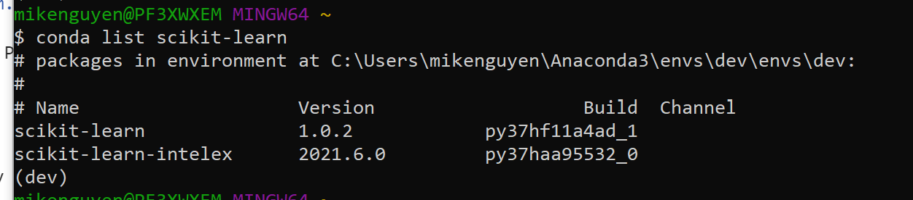
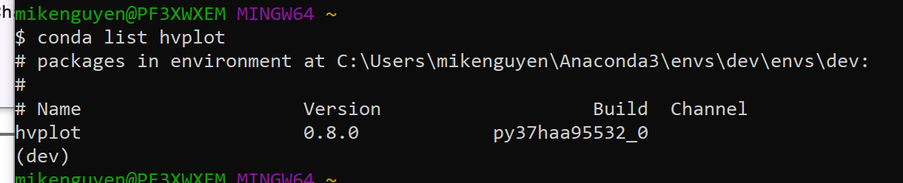
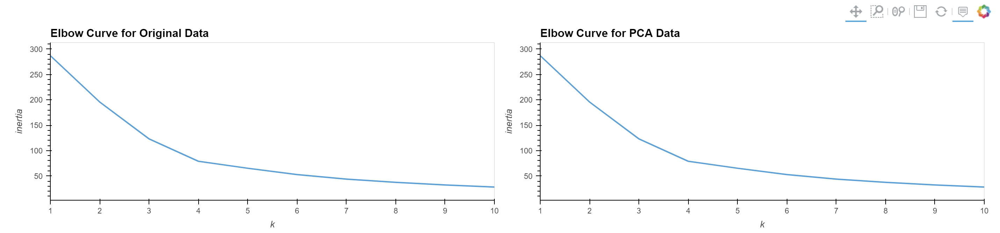
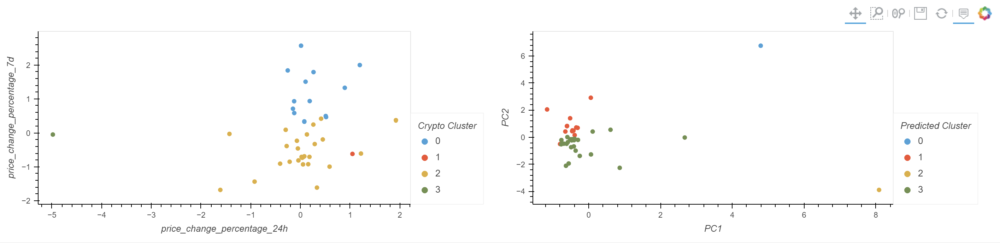

# Cryptocurrency Clusters

An advisor in one of the top five financial advisory firms in the world wants to propose a novel approach to assembling investment portfolios that are based on cryptocurrencies. Instead of basing the proposal on only returns and volatility, other factors that might impact the crypto market will be included—leading to better portfolio performance.

This project includes a Jupyter notebook that clusters cryptocurrencies by their performance in different time periods and visualization plots to present the results.


## Technologies

Programming Languages: Python 3.7.13

Interactive Development Environment: JupyterLab


Libraries: 
- Pandas - A Python library that is used for data manipulation, analysis, and visualization. 
- Scikit-learn - Also known as sklearn, is a popular open-source Python library for machine learning and provides a wide range of algorithms and tools for tasks such as classification, regression, clustering, dimensionality reduction, and model selection. 
- HvPlot - A Python library that provides a high-level interface for quickly creating interactive plots and visualizations using popular plotting libraries such as Matplotlib, Bokeh, and Plotly.
- Warnings - A Python library that provides a way to handle warning messages that may occur during the execution of a program.

Operating System(s):  Any operating system that supports Python, including Windows & macOS.

## Installation Guide

To run this analysis, make sure you install the necessary dependencies:

1. Install Python: https://www.python.org/downloads/
2. Install and run Jupyter Lab:  https://jupyter.org/install
3. Install Anaconda: https://docs.anaconda.com/free/anaconda/install/
4. Install the necessary libraries using pip, the package installer for Python:

Install Pandas
```
pip install pandas  
```
Install scikit-learn
```
pip install -U scikit-learn
```
Install hvPlot
```
conda install -c pyviz hvplot
```
Once scikit-learn is installed, the following should be displayed:


Once hvplot is installed, the following should be displayed:


5. Clone the repository: `git clone "https://github.com/mikenguyenx/10_unsupervisedml_cryptocurrencies"` using git or download the ZIP file and extract it to a local directory.


## Usage

To run the script for this project:

1. Open a terminal or command prompt and navigate to the directory with the analysis.
1. Launch Jupyter Lab: jupyter lab
2. Open `crypto_investments.ipynb` in Jupyter Lab.
3. Run the code cells by clicking on the run button or by pressing the `Shift + Enter` key combination to load and preprocess the data, and generate visualizations
4. This project involves building a Jupyter notebook that clusters cryptocurrencies by their performance in different time periods and visualization plots to present the results.

## Interactive Composite Plots






## Contributors

Mike Nguyen


## License

MIT
